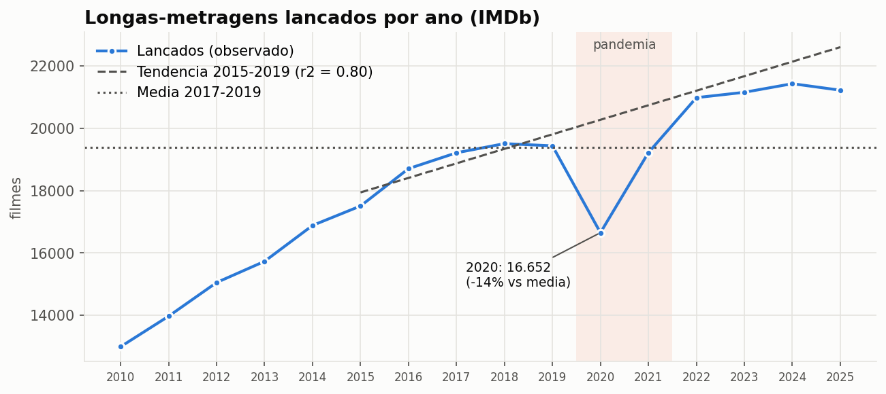
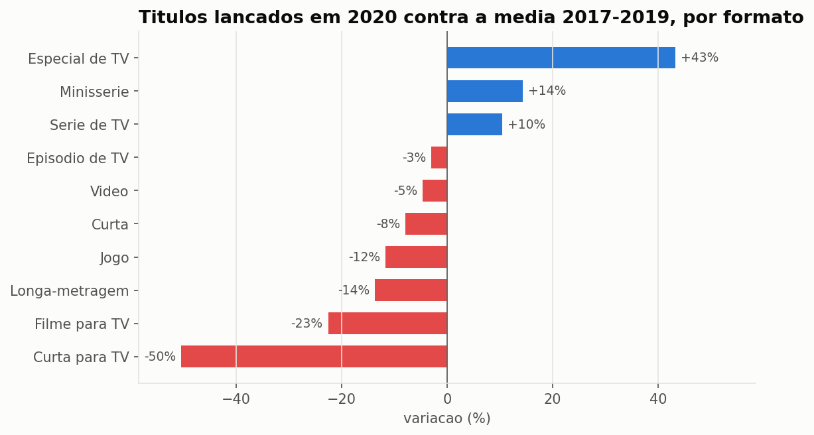
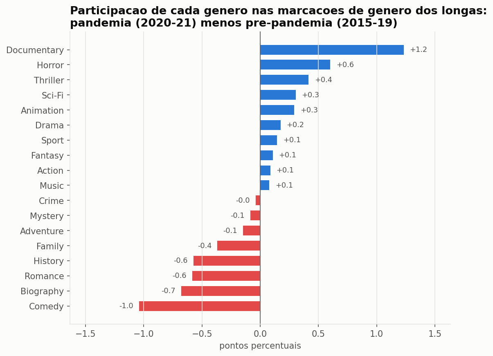
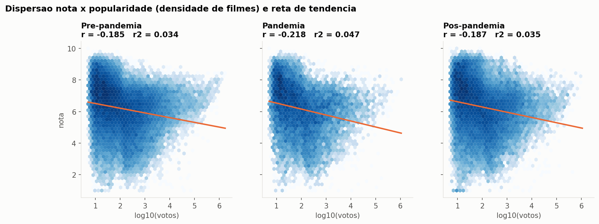
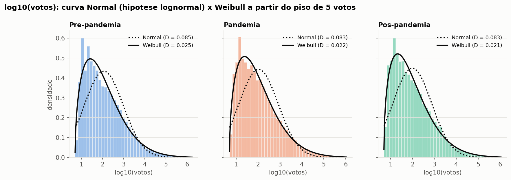

# Big Data: filmes do IMDb e a pandemia de COVID-19

Trabalho da disciplina de Big Data (Unit, 2026/2). A apresentação oral é em **09/10/2026**,
no horário da aula, e dura de 10 a 15 minutos.

O grupo tem dois temas, analisados separadamente. Este repositório concentra o foco em
**Filmes e Classificações (IMDb)**, com o recorte **o que a pandemia mudou na produção e na
recepção de filmes**. O tema do **Clima Global** tem só a análise inicial (ver no final).

| Tema | Base | Volume |
|---|---|---|
| Filmes e Classificações | [IMDb Dataset (Kaggle)](https://www.kaggle.com/datasets/ashirwadsangwan/imdb-dataset), espelho dos IMDb Non-Commercial Datasets | 5 tabelas, 9,7 GB em TSV, 191 milhões de linhas |
| Clima Global | [Berkeley Earth (Kaggle)](https://www.kaggle.com/datasets/berkeleyearth/climate-change-earth-surface-temperature-data) | 5 CSVs, ~600 MB, 8,6 milhões de linhas no maior |

## Como reproduzir

```bash
pip install -r requirements.txt
python -c "import kagglehub; kagglehub.dataset_download('ashirwadsangwan/imdb-dataset'); kagglehub.dataset_download('berkeleyearth/climate-change-earth-surface-temperature-data')"
python filmes/scripts/analise_inicial_filmes.py
python filmes/scripts/analise_pandemia.py
python clima/scripts/analise_inicial_clima.py
```

1. **Download:** o `kagglehub` guarda os arquivos brutos em `~/.cache/kagglehub/`. Para os
   scripts usarem outro caminho, defina as variáveis `IMDB_DIR` e `CLIMA_DIR`.
2. **Conversão:** o primeiro script converte os TSV do IMDb para Parquet em `dados/imdb/`.
   Leva cerca de 1,5 min e ocupa 1,4 GB. A pasta `dados/` fica fora do Git.
3. **Pandemia:** a análise da pandemia lê o Parquet e roda em menos de 1 minuto.

**Ferramenta.** Usamos o [DuckDB](https://duckdb.org), um banco analítico colunar embutido no
Python. Ele executa em paralelo, processa dados maiores que a memória, lê CSV/TSV diretamente e
grava Parquet. As agregações sobre os 12,8 milhões de títulos e a junção de 101 milhões de
linhas rodam em segundos num notebook. O mesmo SQL pode ser levado para o Spark.

## Estrutura

```
├── filmes/
│   ├── scripts/
│   │   ├── analise_inicial_filmes.py   ingestão TSV -> Parquet e visão geral da base
│   │   ├── analise_pandemia.py         recorte da pandemia (foco do trabalho)
│   │   └── metodos.py                  métodos estatísticos das atividades da disciplina
│   └── resultados/
│       ├── *.csv, g*.png, resumo_filmes.md          visão geral
│       └── pandemia/*.csv, g*.png, resumo_pandemia.md
├── clima/                              análise inicial do tema de clima
├── estilo.py                           estilo comum dos gráficos
└── requirements.txt
```

---

## Filmes e pandemia: principais resultados

Períodos comparados: **pré-pandemia** (2015 a 2019), **pandemia** (2020 e 2021) e
**pós-pandemia** (2022 a 2025). Base: longas-metragens não adultos, pelo ano de lançamento.
Resultados completos em [`filmes/resultados/pandemia/resumo_pandemia.md`](filmes/resultados/pandemia/resumo_pandemia.md).

### 1. A produção de longas caiu 14% em 2020 e se recuperou em 2022

- **2020:** foram lançados 16.652 longas, contra a média de 19.389 em 2017–2019.
- **Recuperação:** 2021 voltou quase ao nível anterior (−0,9%), e 2022 superou a média (+8%).
- **Tendência:** a linha de 2015–2019 cresce 466 filmes por ano (r = 0,89, r² = 0,80).
  Contra ela, 2020 ficou 18% abaixo do esperado.
- **Filmes "perdidos":** estimamos entre **2,9 mil e 5,1 mil** longas a menos no biênio
  2020–2021. O menor valor usa a média como referência; o maior, a tendência.



### 2. O conteúdo migrou para a TV e o streaming

Comparando 2020 com a média de 2017–2019:

| Formato | Variação em 2020 |
|---|---:|
| Especial de TV | **+43%** |
| Minissérie | **+14%** |
| Série de TV | **+10%** |
| Longa-metragem | −14% |
| Filme para TV | −23% |
| Curta para TV | −50% |

Em 2021, os **episódios de TV** cresceram 18% (427 mil). Especiais, séries e minisséries
exigem equipes menores e se encaixaram na demanda das plataformas de streaming.



### 3. Documentário e terror ganharam espaço; comédia, biografia e romance perderam

O IMDb permite até 3 gêneros por filme. A média de gêneros por filme caiu de 1,54 para 1,44,
porque o cadastro dos filmes recentes é mais enxuto. Por isso medimos a participação de cada
gênero **no total de marcações de gênero**, que soma 100% em cada período.

- **Ganharam espaço:** Documentário (+1,2 p.p.), Terror (+0,6), Suspense (+0,4), Ficção
  científica e Animação (+0,3). São produções que funcionam com elenco pequeno, material de
  arquivo ou trabalho remoto.
- **Perderam espaço:** Comédia (−1,0), Biografia (−0,7), Romance (−0,6), História (−0,6) e
  Família (−0,4). Em geral dependem de elencos grandes, figurino de época ou contato físico
  entre atores.
- **Depois da pandemia:** Terror e Suspense continuaram crescendo (+1,0 e +1,6 p.p. no
  pós-pandemia). O Documentário voltou para abaixo do nível anterior.



### 4. As notas praticamente não mudaram

- **Médias:** a nota média foi 6,20 antes, 6,15 durante e 6,29 depois da pandemia.
- **Tamanho do efeito:** o d de Cohen entre pandemia e pré-pandemia é −0,03. Abaixo de 0,2,
  o efeito é considerado desprezível. O teste de Mann-Whitney dá p < 0,01, mas isso acontece
  porque, com dezenas de milhares de filmes, quase qualquer diferença passa no teste. É um
  ponto típico de Big Data: **significância estatística não é relevância**.
- **Dispersão:** as notas da pandemia variam um pouco mais (desvio-padrão de 1,57 contra
  1,48).
- **Notas 9 e 10:** a classe [9, 10] dobrou no pós-pandemia (1,6% → 3,4%). O motivo provável
  são filmes recentes com poucos votos, em que alguns votos muito altos pesam mais.
- **Duração:** a mediana caiu de 91 para 90 min na pandemia e subiu para 94 min depois.

### 5. Popularidade explica menos de 5% da nota

- **Correlação:** a correlação de Pearson entre nota e log10(votos) é fraca e negativa em
  todos os períodos: r = −0,19 antes, −0,22 durante e −0,19 depois.
- **r²:** fica entre 3% e 5%.
- **Conferência:** o mesmo r foi calculado de três formas, com `np.corrcoef`, pela fórmula
  cov/(sx·sy) e em SQL com o `corr()` do DuckDB. Os três coincidem.



### 6. Os votos seguem uma Weibull, não uma lognormal

- **Hipótese inicial:** votos seguiriam uma lognormal, com log10(votos) normal.
- **Ajuste ruim:** a normal se ajusta mal (D de Kolmogorov-Smirnov = 0,085). Há dois motivos:
  o IMDb só publica nota com **5 votos ou mais**, o que trunca os dados, e o log dos votos
  continua assimétrico (assimetria ≈ 1).
- **Melhor ajuste:** uma **Weibull** que começa no piso de 5 votos se ajusta muito melhor
  (D = 0,021 a 0,025).
- **Pandemia:** o formato da distribuição é o mesmo nos três períodos.



### Cuidados na interpretação

- **Tempo para acumular votos:** filmes recentes tiveram menos tempo para receber votos. Por
  isso a queda da mediana de votos (74 → 69 → 64) não pode ser atribuída à pandemia.
- **Data de lançamento:** `startYear` é o ano de lançamento registrado no IMDb. Filmes
  adiados aparecem no ano em que de fato saíram.
- **Cobertura do cadastro:** o IMDb é uma base colaborativa e cresce com o tempo. Parte da
  alta recente é maior cobertura de cadastro, não só mais filmes produzidos.
- **País de produção:** a base não informa o país de produção. Não dá para separar o cinema
  brasileiro.

---

## Métodos das atividades aplicados

Os métodos das atividades da disciplina foram reunidos em
[`filmes/scripts/metodos.py`](filmes/scripts/metodos.py) e aplicados na análise da pandemia:

| Atividade da disciplina | Método | Onde foi aplicado |
|---|---|---|
| Atividade 03 (Estatística) | Média, mediana, moda, amplitude, quartis, IQR, desvio-padrão, variância e coeficiente de variação | Seção 4: nota, duração e votos por período ([`04_descritivas_por_periodo.csv`](filmes/resultados/pandemia/04_descritivas_por_periodo.csv)) |
| Atividade 03 (Estatística) | Tabela de frequências por classes (absoluta, relativa, percentual e acumulada) | Seção 4: notas em classes de 1 ponto ([`05_frequencia_notas.csv`](filmes/resultados/pandemia/05_frequencia_notas.csv)) |
| Atividade 03 / Aula 06 | Boxplot (quartis) | [`g4_boxplots.png`](filmes/resultados/pandemia/g4_boxplots.png) |
| Aula 06 e Medida de eficiência | Covariância amostral, r de Pearson, r², conferência r = cov/(sx·sy) e reta de tendência | Seção 1 (tendência de produção 2015–2019) e seção 5 (nota × popularidade, nota × duração) |
| Exemplos de Distribuições | Histograma comparado a curvas teóricas: Normal, Exponencial, Gama e Weibull | Seção 6: distribuição dos votos, com aderência medida pelo teste de Kolmogorov-Smirnov |

Adaptações para o volume de dados:
- **Variância vetorizada:** o desvio-padrão e a variância usam `numpy` (`ddof=1`), que dá o
  mesmo resultado de `statistics.stdev` e `statistics.variance`, mas é vetorizado. Com mais
  de 100 mil valores, o módulo `statistics` fica lento.
- **Dispersão com densidade:** com dezenas de milhares de pontos, o gráfico de dispersão virou
  um mapa de densidade (hexbin).

A seção 7 (tamanho do efeito com d de Cohen e teste de Mann-Whitney) vai além das atividades.

## Visão geral da base IMDb

Resultados completos em [`filmes/resultados/resumo_filmes.md`](filmes/resultados/resumo_filmes.md).

- **Tamanho:** 5 tabelas ligadas por `tconst` (título) e `nconst` (pessoa). Em Parquet, os
  9,7 GB viram 1,4 GB, 6,7 vezes menos.
- **Avaliações:** só 13% dos 12,8 milhões de títulos têm avaliação, e 77% são episódios de TV.
- **Cauda longa:** 1% dos filmes concentra 69% dos votos.
- **Viés de sobrevivência:** filmes antigos têm notas maiores.
- **Qualidade dos dados:** 64% dos títulos não têm duração. Há títulos com ano futuro, e a
  tabela `akas` traz milhões de títulos genéricos traduzidos.

## Outro tema: Clima Global (análise inicial)

Resultados em [`clima/resultados/resumo_clima.md`](clima/resultados/resumo_clima.md).

- **Aquecimento acelerando:** a terra aqueceu 0,85 °C por século em 1850–2015 e 2,65 °C por
  século em 1980–2015.
- **Por país:** nenhum dos 228 países com série suficiente esfriou. O Brasil aqueceu +0,97 °C.
- **Qualidade dos dados:** o CSV tem aspas mal detectadas e mistura países com continentes. Só
  16 das 27 UFs aparecem, e a série termina em 2013.

## Leitura "Big Data" (5 Vs)

| V | Filmes | Clima |
|---|---|---|
| Volume | 191 milhões de linhas, 9,7 GB | 8,6 milhões de linhas |
| Variedade | 5 tabelas relacionais; campos com vários valores | séries temporais com coordenadas |
| Velocidade | o IMDb atualiza os arquivos diariamente | base estática (até 2013) |
| Veracidade | nulos, truncamento em 5 votos, votos manipuláveis, cadastro variável | incerteza 10 vezes maior no século XIX; valores interpolados |
| Valor | impacto da pandemia na indústria; o que explica a nota | evidência do aquecimento acelerado |

## Fontes

- IMDb. *IMDb Non-Commercial Datasets* (developer.imdb.com/non-commercial-datasets),
  espelhados no Kaggle por Ashirwad Sangwan. Uso pessoal e não comercial; os dados não são
  redistribuídos neste repositório.
- Berkeley Earth. *Climate Change: Earth Surface Temperature Data* (Kaggle). Rohde, R. et al.
  (2013). *A New Estimate of the Average Earth Surface Land Temperature Spanning 1753 to 2011*.
- Cohen, J. (1988). *Statistical Power Analysis for the Behavioral Sciences*, 2. ed. Erlbaum.
- Período-base 1951–1980 para anomalias de temperatura: convenção do NASA GISS (GISTEMP).
